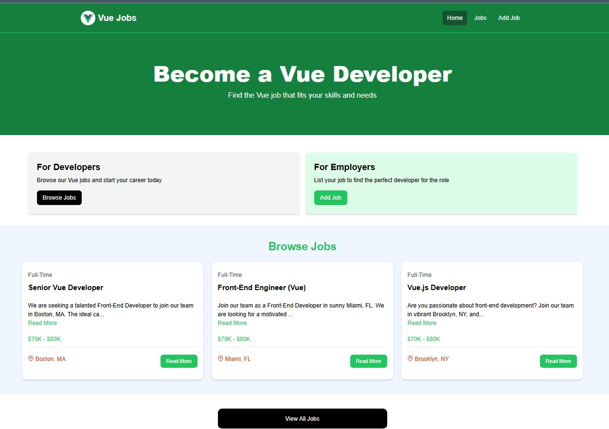

# vue-app-joblistings

This app is for showing job listings and we can make the CRUD action using JSON server



## Recommended IDE Setup

[VSCode](https://code.visualstudio.com/) + [Volar](https://marketplace.visualstudio.com/items?itemName=Vue.volar) (and disable Vetur).

## Customize configuration

See [Vite Configuration Reference](https://vite.dev/config/).

## Project Setup

```sh
npm install
```

### Compile and Hot-Reload for Development

```sh
npm run dev
```

### Compile and Minify for Production

```sh
npm run build
```
